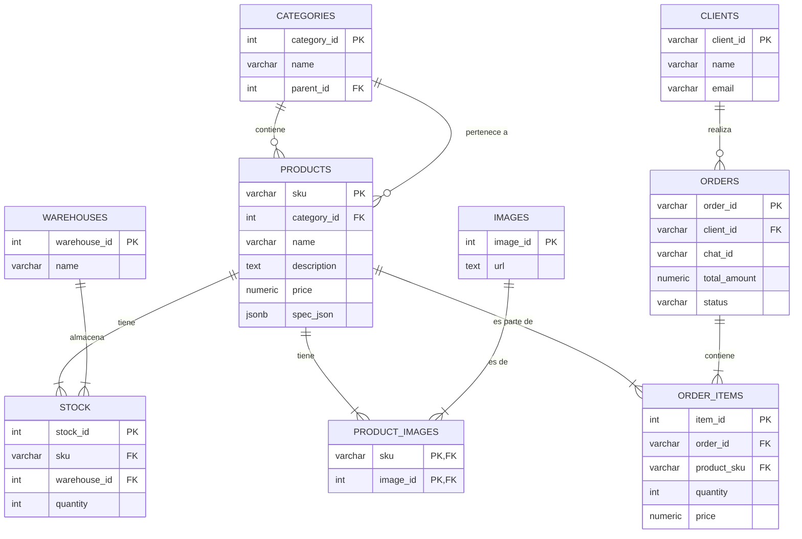

# Esquema de la Base de Datos de Macroferro

Este documento detalla la estructura de la base de datos PostgreSQL utilizada por el sistema Macroferro. Describe cada tabla, sus columnas y las relaciones que existen entre ellas.

---

## Diagrama de Relaciones (Simplificado)

---

## Descripción de Tablas

### `categories`
Almacena las categorías de los productos, permitiendo una estructura jerárquica anidada.

| Columna | Tipo | Restricciones | Descripción |
|---|---|---|---|
| `category_id` | INT | **PK** | Identificador único de la categoría. |
| `name` | VARCHAR(255) | NOT NULL | Nombre de la categoría (ej: "Tornillería"). |
| `parent_id` | INT | FK | ID de la categoría padre. Es `NULL` si es una categoría de nivel superior. |

**Relaciones:**
- `parent_id` se refiere a `categories(category_id)`. Una categoría puede tener una categoría padre, creando una jerarquía.

---

### `products`
El catálogo principal de productos que ofrece Macroferro.

| Columna | Tipo | Restricciones | Descripción |
|---|---|---|---|
| `sku` | VARCHAR(50) | **PK** | "Stock Keeping Unit", el identificador de negocio único para cada producto. |
| `category_id` | INT | FK | La categoría a la que pertenece el producto. |
| `name` | VARCHAR(255) | NOT NULL | Nombre comercial del producto. |
| `description` | TEXT | | Descripción detallada del producto. |
| `price` | NUMERIC(10, 2) | NOT NULL, CHECK >= 0 | Precio unitario del producto. |
| `brand` | VARCHAR(100) | | La marca del producto. |
| `spec_json` | JSONB | | Especificaciones técnicas en formato JSON flexible (ej: `{"voltaje": "220V", "peso": "2.5kg"}`). |
| `created_at` | TIMESTAMPTZ | DEFAULT | Timestamp de cuándo se creó el registro del producto. |
| `updated_at` | TIMESTAMPTZ | DEFAULT | Timestamp de la última actualización, gestionado por un trigger. |

**Relaciones:**
- `category_id` se refiere a `categories(category_id)`. Cada producto pertenece a una categoría.

---

### `images`
Almacena las URLs de las imágenes de los productos para evitar duplicados.

| Columna | Tipo | Restricciones | Descripción |
|---|---|---|---|
| `image_id` | SERIAL | **PK** | Identificador único autoincremental para cada imagen. |
| `url` | TEXT | UNIQUE, NOT NULL | La URL completa de la imagen. |
| `alt_text` | VARCHAR(255) | | Texto alternativo para la imagen (accesibilidad). |

---

### `product_images`
Tabla de unión (pivote) que establece una relación muchos-a-muchos entre `products` e `images`.

| Columna | Tipo | Restricciones | Descripción |
|---|---|---|---|
| `sku` | VARCHAR(50) | **PK**, FK | Clave foránea que referencia a `products(sku)`. |
| `image_id` | INT | **PK**, FK | Clave foránea que referencia a `images(image_id)`. |

**Relaciones:**
- Un producto puede tener múltiples imágenes.
- Una misma imagen podría, teóricamente, ser usada por múltiples productos.

---

### `clients`
Contiene la información de los clientes registrados de Macroferro.

| Columna | Tipo | Restricciones | Descripción |
|---|---|---|---|
| `client_id` | VARCHAR(50) | **PK** | Identificador de negocio único para el cliente (ej: `CUST0001`). |
| `name` | VARCHAR(255) | | Nombre completo del cliente o de la empresa. |
| `email` | VARCHAR(255) | UNIQUE, NOT NULL | Correo electrónico del cliente. Se usa como identificador único para login/recuperación. |
| `phone` | VARCHAR(50) | | Número de teléfono de contacto. |
| `address` | TEXT | | Dirección principal de envío o fiscal. |

---

### `warehouses`
Define los almacenes físicos donde se guarda el stock de los productos.

| Columna | Tipo | Restricciones | Descripción |
|---|---|---|---|
| `warehouse_id` | INT | **PK** | Identificador único del almacén. |
| `name` | VARCHAR(255) | NOT NULL | Nombre del almacén (ej: "Almacén Central"). |
| `address` | TEXT | | Dirección física del almacén. |

---

### `stock`
Registra la cantidad de cada producto disponible en cada almacén.

| Columna | Tipo | Restricciones | Descripción |
|---|---|---|---|
| `stock_id` | SERIAL | **PK** | Identificador único autoincremental. |
| `sku` | VARCHAR(50) | NOT NULL, FK | El producto cuyo stock se está registrando. |
| `warehouse_id` | INT | NOT NULL, FK | El almacén donde se encuentra este stock. |
| `quantity` | INT | NOT NULL, CHECK >= 0 | Cantidad de unidades disponibles. No puede ser negativa. |

**Relaciones:**
- `sku` se refiere a `products(sku)`.
- `warehouse_id` se refiere a `warehouses(warehouse_id)`.
- La combinación de `sku` y `warehouse_id` es `UNIQUE` para asegurar que solo haya un registro de stock por producto y almacén.

---

### `orders`
La tabla principal para las transacciones. Contiene la información de cabecera de cada pedido realizado.

| Columna | Tipo | Restricciones | Descripción |
|---|---|---|---|
| `order_id` | VARCHAR(50) | **PK** | Identificador de negocio único para el pedido (ej: `ORD00001`). |
| `client_id` | VARCHAR(50) | FK | Cliente que realizó el pedido (si estaba registrado). Puede ser `NULL`. |
| `chat_id` | VARCHAR(255) | NOT NULL | ID del chat de Telegram desde donde se originó el pedido. |
| `customer_name` | VARCHAR(255) | NOT NULL | Nombre del cliente en el momento de la compra. |
| `customer_email` | VARCHAR(255)| NOT NULL | Email del cliente en el momento de la compra. |
| `shipping_address`| TEXT | NOT NULL | Dirección de envío para este pedido concreto. |
| `total_amount`| NUMERIC(10, 2)| NOT NULL, CHECK >= 0 | El coste total del pedido. |
| `status` | VARCHAR(50) | NOT NULL, DEFAULT 'pending' | Estado actual del pedido (ej: 'pending', 'confirmed', 'shipped'). |
| `pdf_url` | TEXT | | URL al PDF de la factura/albarán, si se genera. |
| `created_at` | TIMESTAMPTZ | DEFAULT | Timestamp de la creación del pedido. |
| `updated_at` | TIMESTAMPTZ | DEFAULT | Timestamp de la última actualización, gestionado por un trigger. |

**Relaciones:**
- `client_id` se refiere a `clients(client_id)`.

---

### `order_items`
Tabla de detalle que desglosa los productos específicos, cantidades y precios para cada orden.

| Columna | Tipo | Restricciones | Descripción |
|---|---|---|---|
| `item_id` | SERIAL | **PK** | Identificador único para cada línea de pedido. |
| `order_id` | VARCHAR(50) | NOT NULL, FK | El pedido al que pertenece esta línea. |
| `product_sku` | VARCHAR(50) | NOT NULL, FK | El producto que se vendió. |
| `quantity` | INT | NOT NULL, CHECK > 0 | Número de unidades vendidas de este producto. |
| `price` | NUMERIC(10, 2) | NOT NULL, CHECK >= 0 | El precio unitario del producto en el momento exacto de la compra. |

**Relaciones:**
- `order_id` se refiere a `orders(order_id)`. Una orden tiene múltiples items.
- `product_sku` se refiere a `products(sku)`. `ON DELETE RESTRICT` previene borrar un producto si ya ha sido vendido en una orden. 